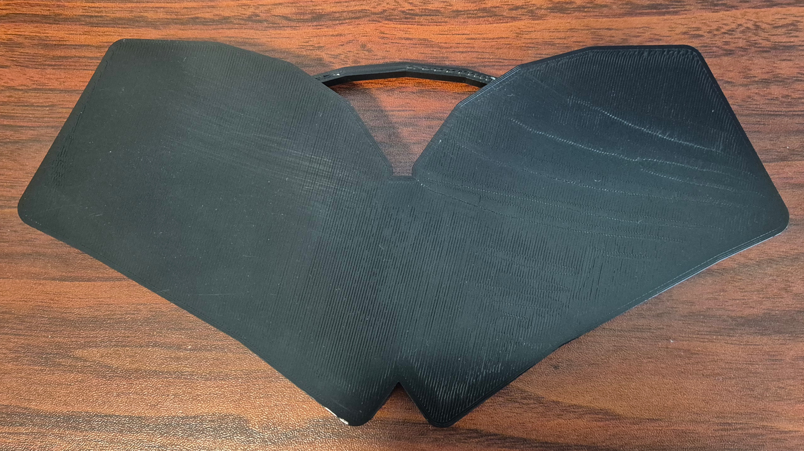

# Koumori Keyboard

- 28 keys
- Unibody design
- RP2040-Zero MCU
- Cirque 40mm trackpad with glass overlay
- Customizable layout with QMK Firmware
- Case with handle and magnetic lid
- PCB and case designed in [Ergogen](https://ergogen.xyz)
- Simple to build with no microscopic parts and a detailed [build guide](./build.md)
- Name means the animal "bat" in Japanese
- Open source and free (GPL-3.0)
