# Build

## BOM

| Name                                                                                        | Qty | Link                                                                                                                 |
| ------------------------------------------------------------------------------------------- | --- | -------------------------------------------------------------------------------------------------------------------- |
| PCB (kicad/production/koumori_v1.0.0.zip)                                                   | 1   | <https://jlcpcb.com/>                                                                                                |
| Cirque 40mm Trackpad TM040040-2024-302 with flat overlay                                    | 1   | <https://au.mouser.com/ProductDetail/Cirque/TM040040-2024-302>                                                       |
| Choc v1 Switches                                                                            | 28  | <https://keebd.com/products/ambients-silent-linear-nocturnal-choc-switches>                                          |
| Choc v1 Keycaps                                                                             | 28  | <https://chosfox.com/collections/cfx-keycaps/products/chocfox-cfx-choc-keycaps>                                      |
| RP2040 Zero MCU                                                                             | 1   | <https://www.aliexpress.com/item/1005007650325892.html>                                                              |
| 1N4148W diodes                                                                              | 28  | <https://www.aliexpress.com/item/4000685043735.html>                                                                 |
| Choc v1 Hot-Swap Socket (Low Profile)                                                       | 28  | <https://www.aliexpress.com/item/1005006625852715.html> Note: these ones had a slightly annoying to solder metal tab |
| M2 Screw 4mm                                                                                | 8   | <https://www.aliexpress.com/item/4001248931159.html>                                                                 |
| M2 Screw 6mm                                                                                | 3   | <https://www.aliexpress.com/item/4001248931159.html>                                                                 |
| M2 knurled insert nuts 3mm length 3.5mm OD                                                  | 11  | <https://www.aliexpress.com/item/1005008897571758.html>                                                              |
| Neodymium Magnets 6mm x 3mm                                                                 | 8   | <https://www.aliexpress.com/item/1005010074888189.html>                                                              |
| Wire (30 AWG)                                                                               | 1   | <https://www.aliexpress.com/item/1005007256968315.html>                                                              |
| Adhesive Vinyl Sheets                                                                       | 1   | <https://www.aliexpress.com/item/1005009732820762.html>                                                              |
| 40mm Glass Smartwatch Screen Protector (**NOT** Galaxy Watch 40mm which is actually 36.5mm) | 1   | <https://www.aliexpress.com/item/1005007458477781.html>                                                              |
| USB-C Cable                                                                                 | 1   | <https://www.aliexpress.com/item/1005005931593343.html>                                                              |
| Blutak                                                                                      | 1   |                                                                                                                      |
| Superglue                                                                                   | 1   |                                                                                                                      |
| 3D Printed Case (3d/case.stl)                                                               | 1   |                                                                                                                      |
| 3D Printed Lid (3d/lid.stl)                                                                 | 1   |                                                                                                                      |
| 3D Printed Cirque Mount (3d/cirque-mount.stl)                                               | 1   |                                                                                                                      |

## Build

- Flash the firmware first to make sure your MCU is ok <https://github.com/dlip/qmk_firmware/tree/dlip/keyboards/dlip/koumori>
- Tin the left side of all the pads on the back (side containing the url)

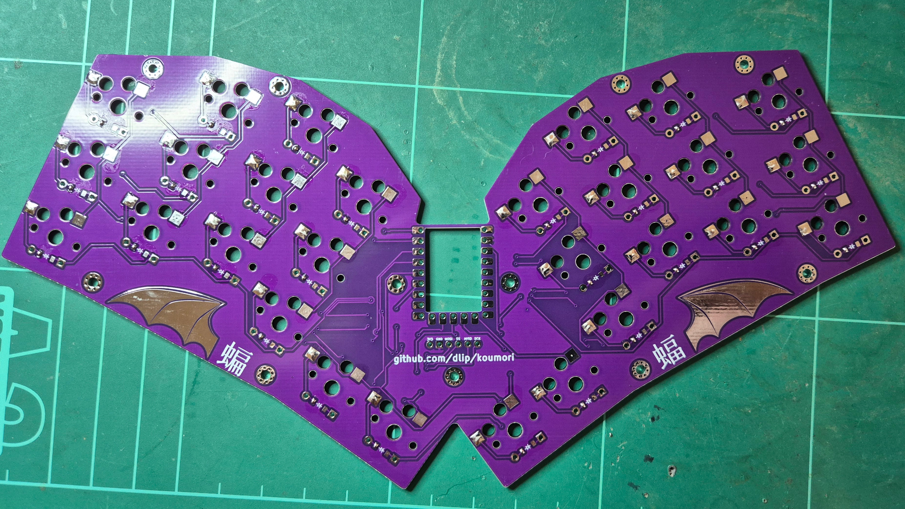

- Before soldering, note the correct direction of the diodes following the side with the line

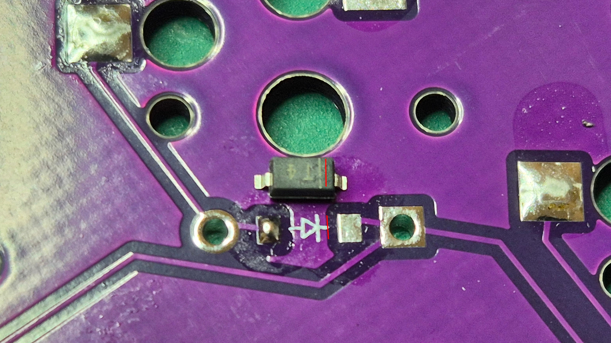

- Solder the left side of the diodes and hot swap sockets, ensuring they are aligned, then solder the right sides. Note: I was short on hot swap sockets here, so some are missing

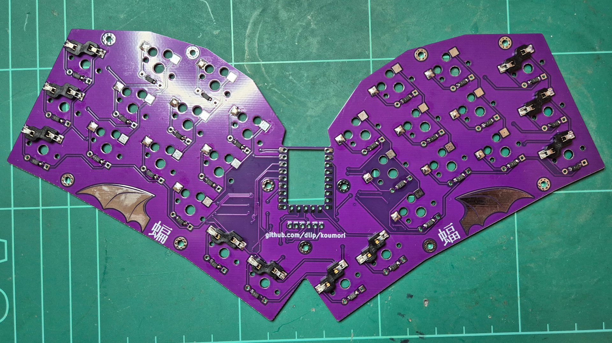

- Flip over to the front side
- Tin the pads for the MCU

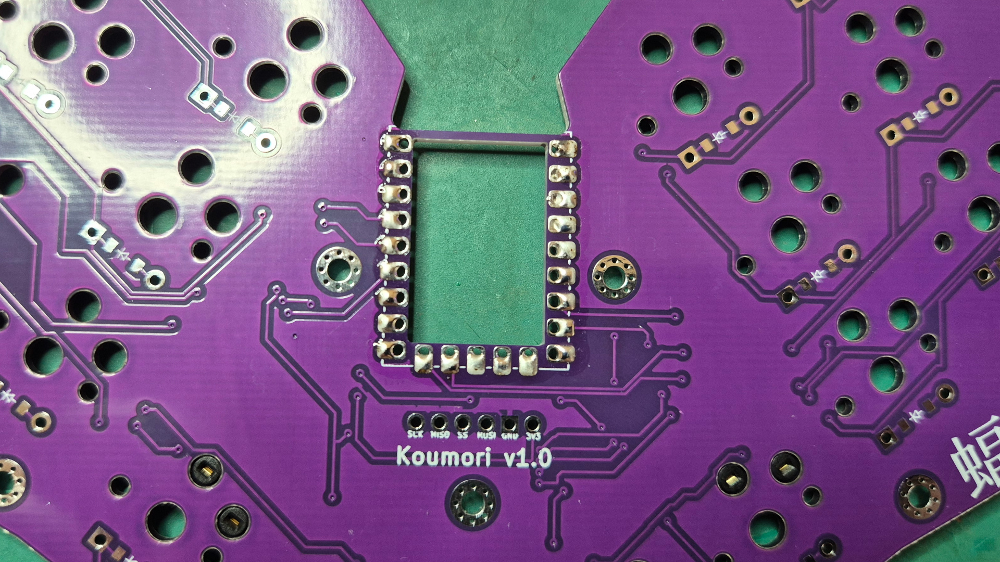

- Solder one pin on the MCU and ensure it is aligned perfectly
- Solder the pin on the opposite corner to ensure it won't move
- Solder the remaining pins

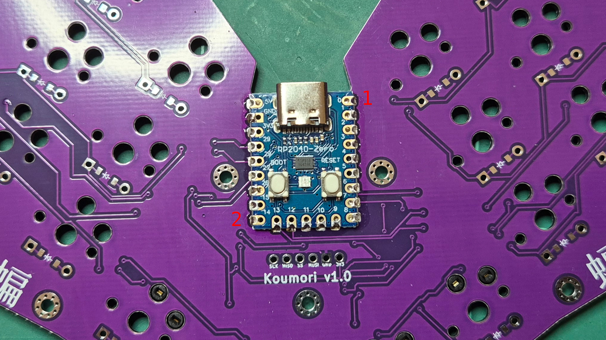

- Peel off stock overlay from Cirque
- Stick glass protector to vinyl sheet
- Cut out using scissors and a X-Acto knife
- Stick on Cirque

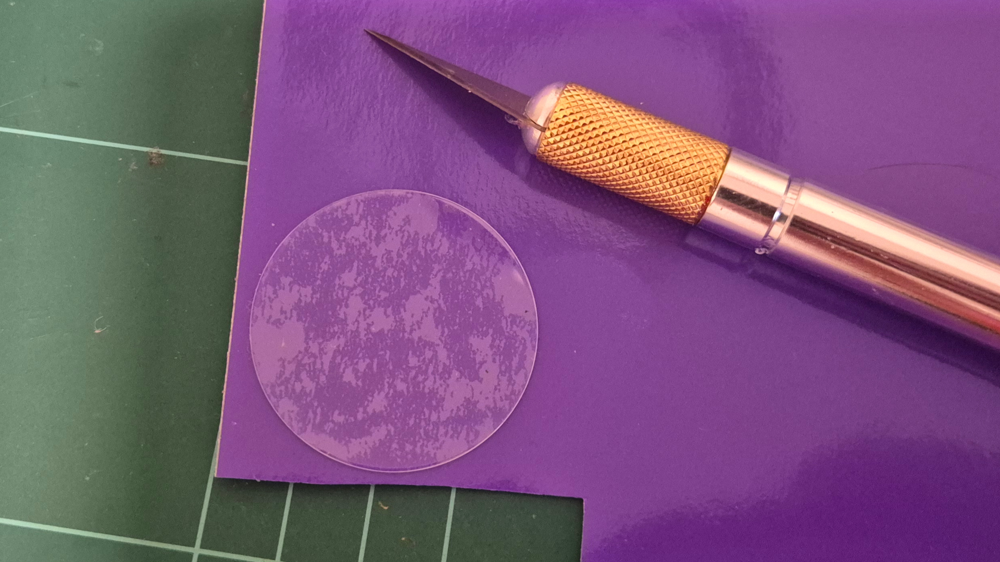

- Solder Cirque using about 10 cm wire stripped at the ends using the following mapping
  - SCK -> SCK
  - MISO -> SO
  - SS -> SS
  - MOSI -> SI
  - GND -> GND
  - 3V3 -> VDD

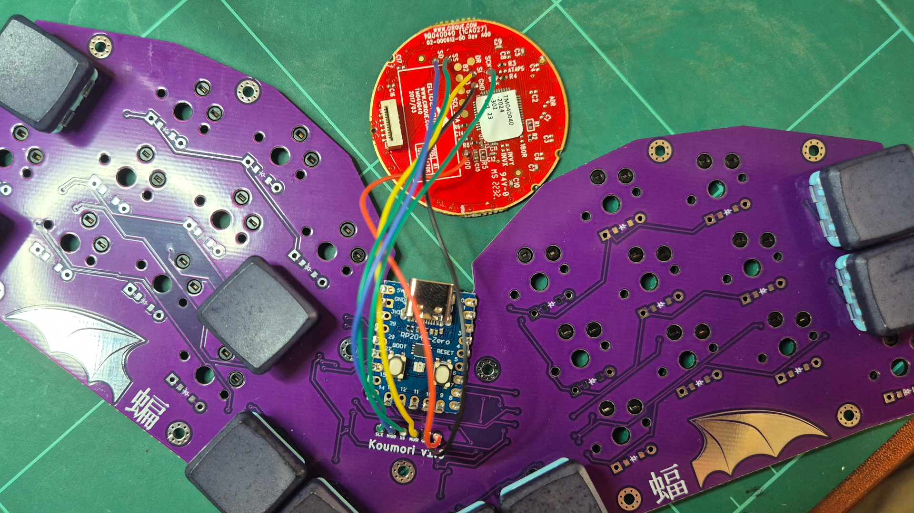

- Add switches and keycaps
- Connect USB and test everything is working
- Melt knurled nuts into base with soldering iron at around 180c
- Mark the side of the magnets you intend to point upwards
- Superglue magnets into base, ensuring your mark **IS** showing

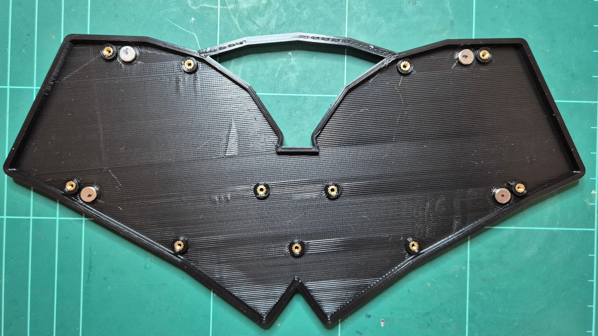

- Screw 3x6mm screws in the center region and 8x4mm in the remaining holes

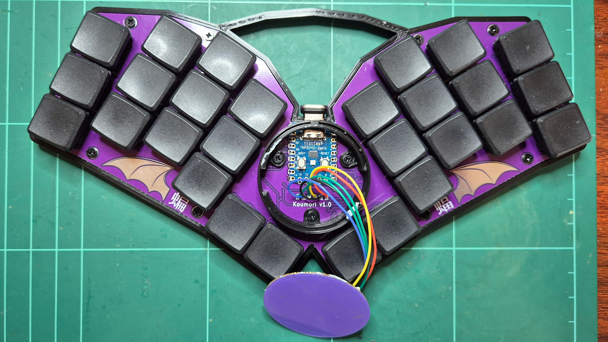

- Add rubber feet

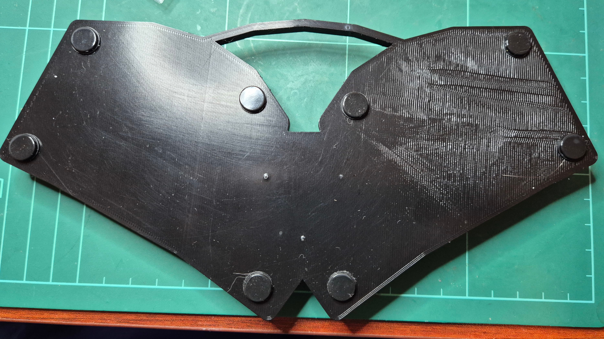

- Superglue magnets into lid, ensuring your mark **IS NOT** showing

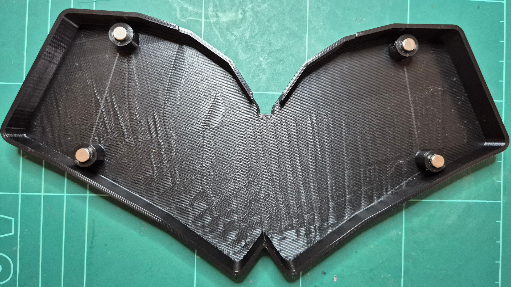

- Add a small amount of Blutak to keep the Cirque from moving and push it down, ensuring the 2 notches match in the top right

- Done!

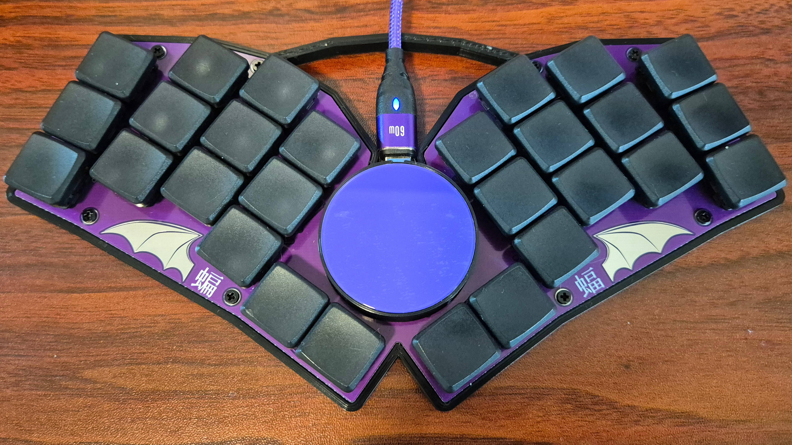
